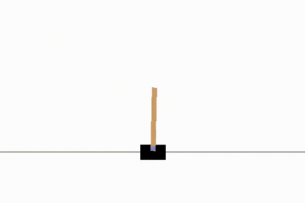

## If you are curious.

##### Train a Cartpole agent and watch it play once it converges!

Here's a list of commands to run to quickly get a working example:




```bash
# Train model and save the results to cartpole_model.pkl
python -m baselines.run --alg=deepq --env=CartPole-v0 --save_path=./cartpole_model.pkl --num_timesteps=1e5
# Load the model saved in cartpole_model.pkl and visualize the learned policy
python -m baselines.run --alg=deepq --env=CartPole-v0 --load_path=./cartpole_model.pkl --num_timesteps=0 --play
```

## If you wish to apply DQN to solve a problem.

Check out our simple agent trained with one stop shop `deepq.learn` function. 

- [baselines/deepq/experiments/train_cartpole.py](experiments/train_cartpole.py) - train a Cartpole agent.

In particular notice that once `deepq.learn` finishes training it returns `act` function which can be used to select actions in the environment. Once trained you can easily save it and load at later time. Complimentary file `enjoy_cartpole.py` loads and visualizes the learned policy.

## If you wish to experiment with the algorithm

##### Check out the examples

- [baselines/deepq/experiments/custom_cartpole.py](experiments/custom_cartpole.py) - Cartpole training with more fine grained control over the internals of DQN algorithm.
- [baselines/deepq/defaults.py](defaults.py) - settings for training on atari. Run 

```bash
python -m baselines.run --alg=deepq --env=PongNoFrameskip-v4 
```
to train on Atari Pong (see more in repo-wide [README.md](../../README.md#training-models))


