# Results of GAIL/BC on Mujoco

Here's the extensive experimental results of applying GAIL/BC on Mujoco environments, including 
Hopper-v1, Walker2d-v1, HalfCheetah-v1, Humanoid-v1, HumanoidStandup-v1. Every imitator is evaluated with seed to be 0.

## Results

### Training through iterations

- Hoppers-v1
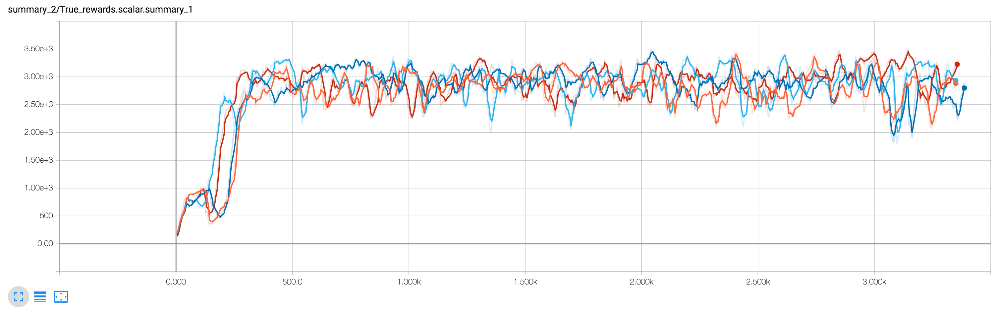 

- HalfCheetah-v1
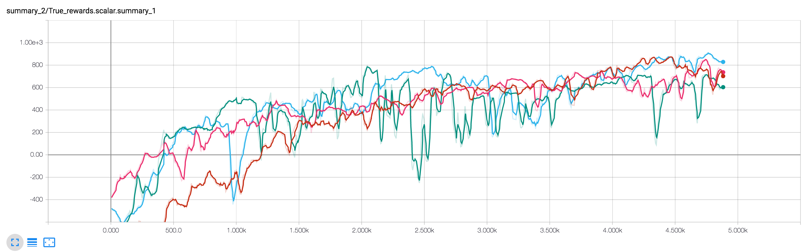 

- Walker2d-v1
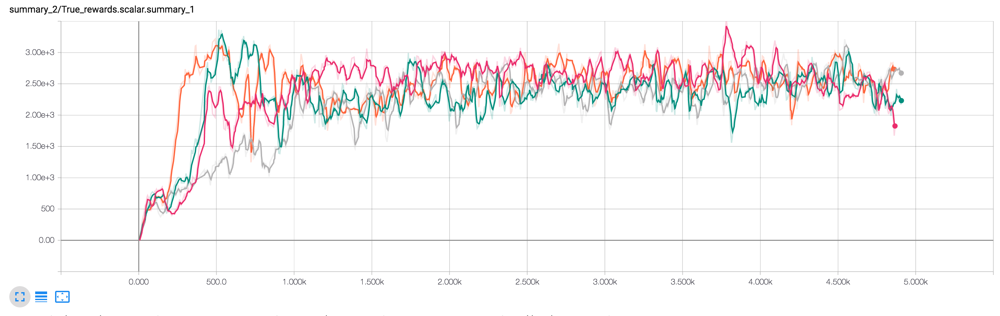 

- Humanoid-v1
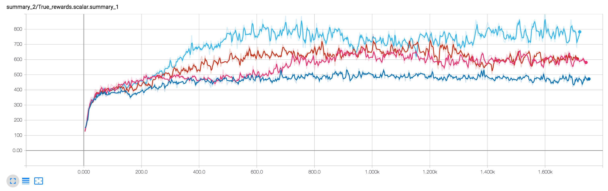 

- HumanoidStandup-v1
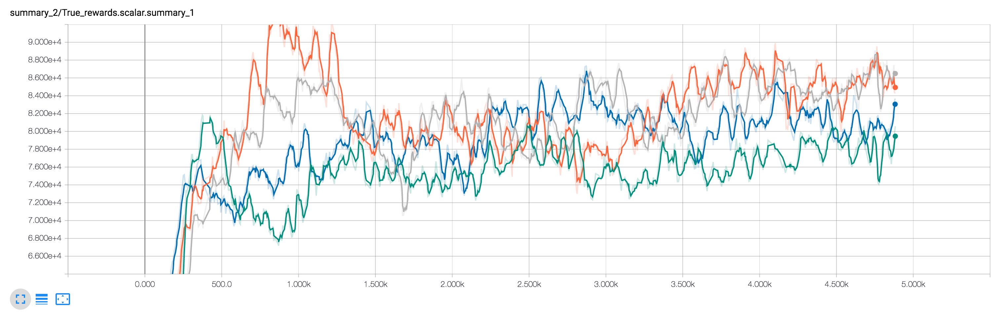 

For details (e.g., adversarial loss, discriminator accuracy, etc.) about GAIL training, please see [here](https://drive.google.com/drive/folders/1nnU8dqAV9i37-_5_vWIspyFUJFQLCsDD?usp=sharing)

### Determinstic Policy (Set std=0)
|   | Un-normalized | Normalized |
|---|---|---|
| Hopper-v1 | 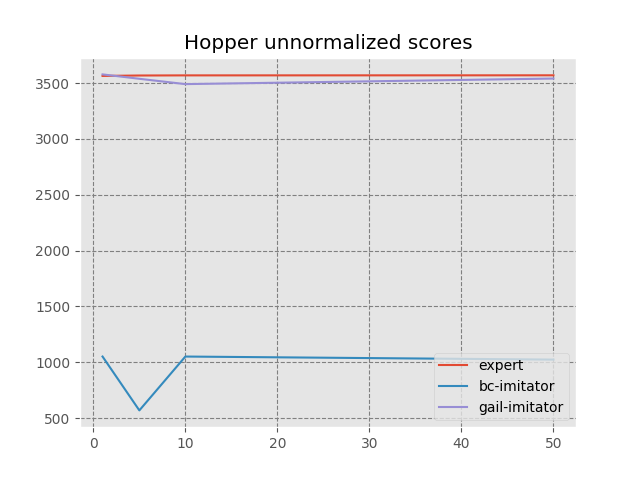 | 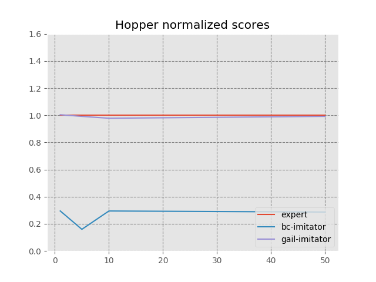 |
| HalfCheetah-v1 | 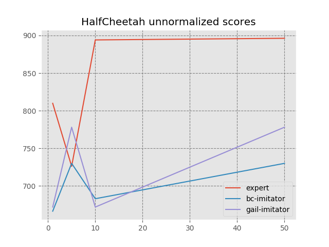 | 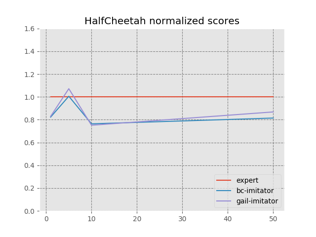 |
| Walker2d-v1 | 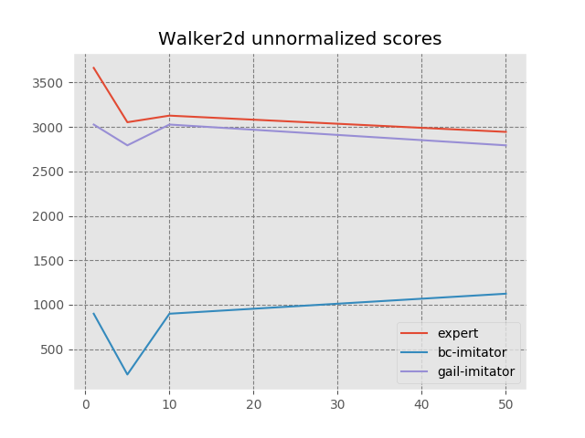 |  |
| Humanoid-v1 | 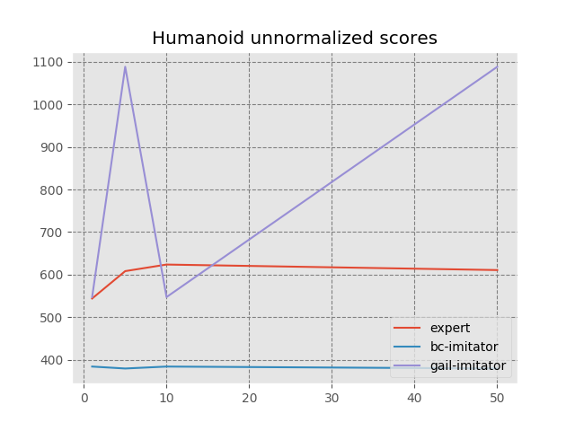 | 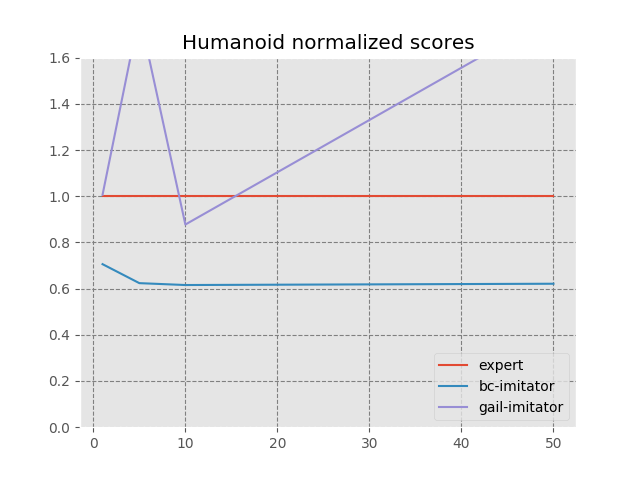 |
| HumanoidStandup-v1 | 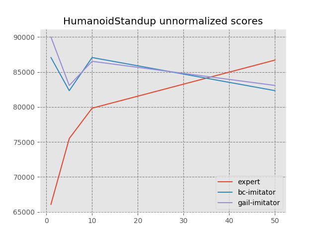 | 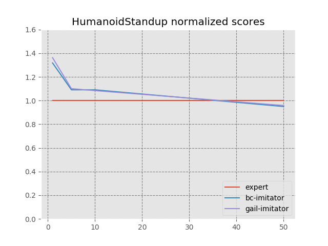 |

### Stochatic Policy 
|   | Un-normalized | Normalized |
|---|---|---|
| Hopper-v1 | 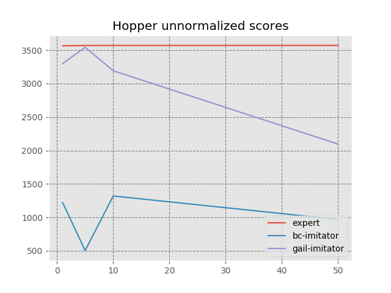 | 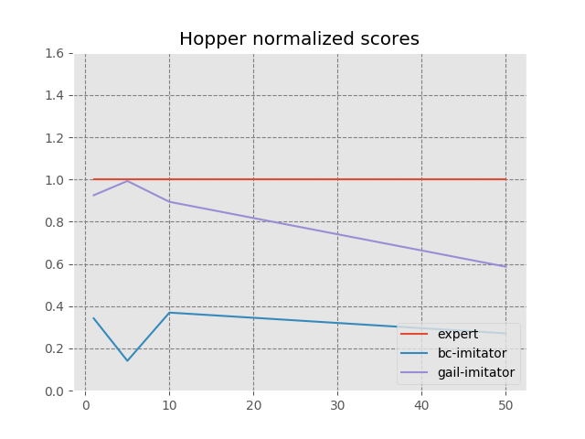 |
| HalfCheetah-v1 |  | 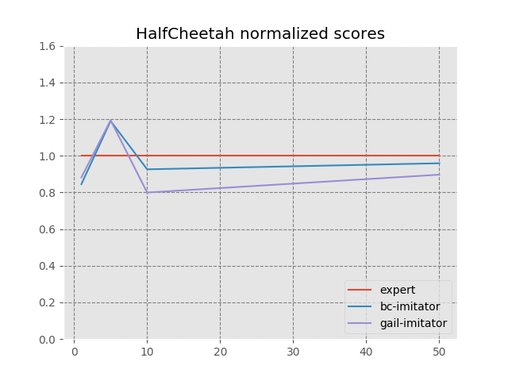 |
| Walker2d-v1 | 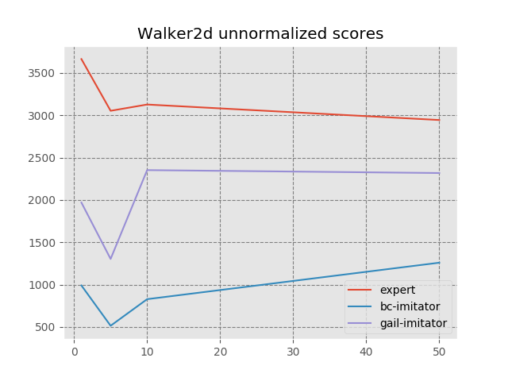 | 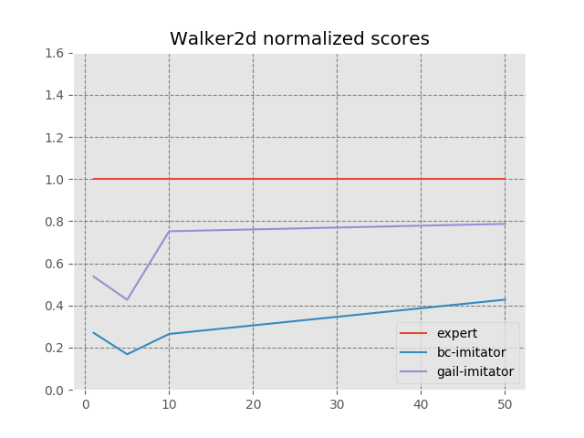 |
| Humanoid-v1 | 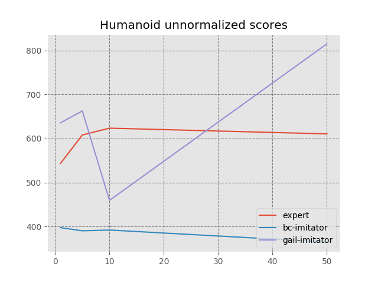 | 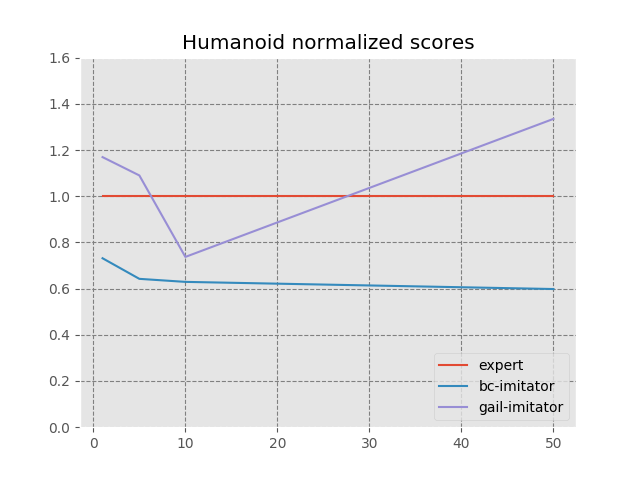 |
| HumanoidStandup-v1 | 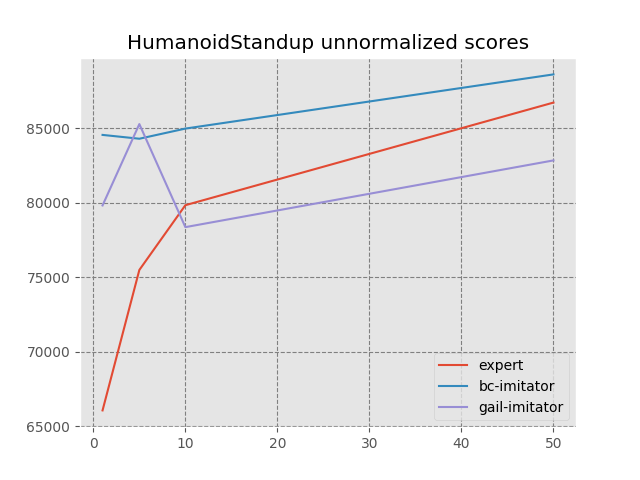 | 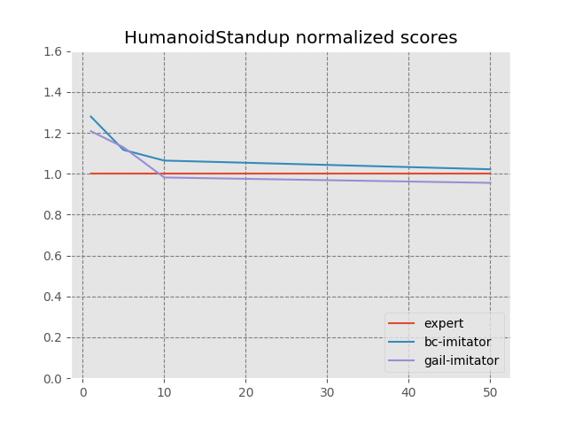 |

### details about GAIL imitator

For all environments, the 
imitator is trained with 1, 5, 10, 50 trajectories, where each trajectory contains at most 
1024 transitions, and seed 0, 1, 2, 3, respectively.

### details about the BC imitators

All BC imitators are trained with seed 0.
