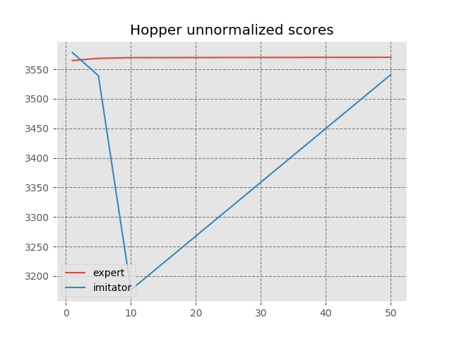
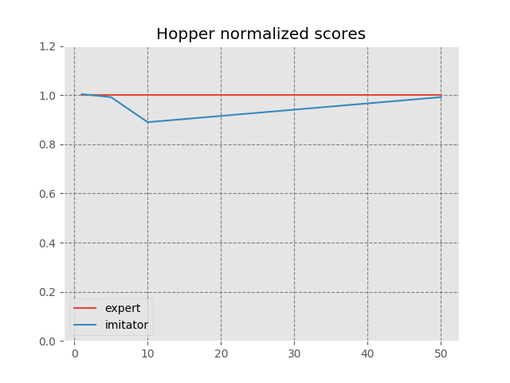
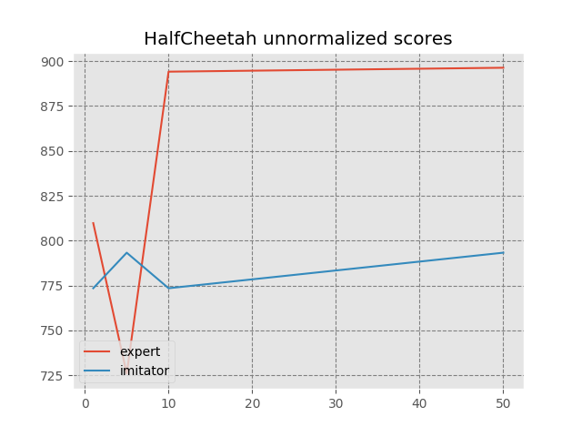
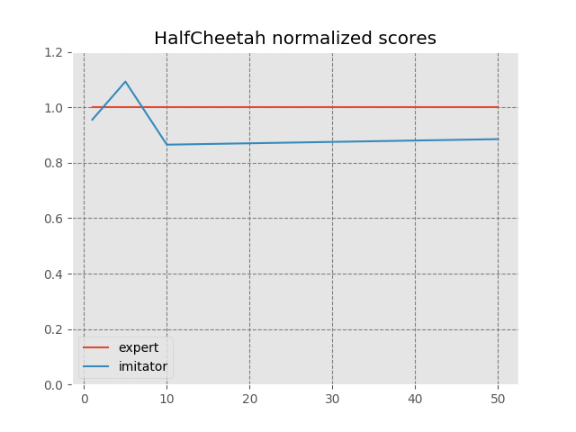
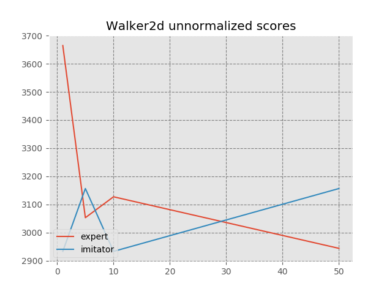
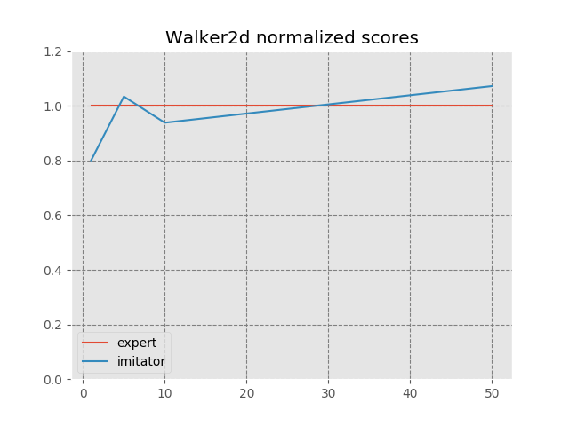
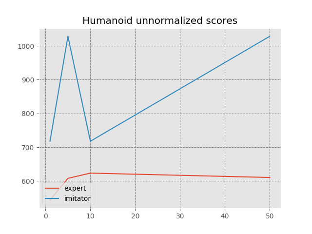
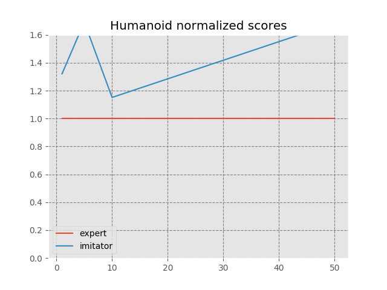
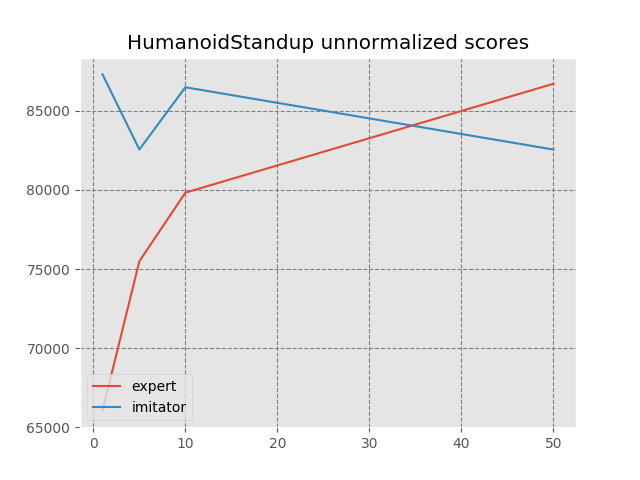
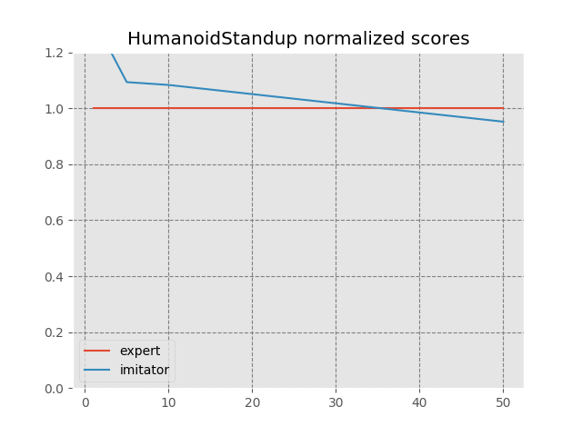

# Results for GAIL on Mujoco

Here's the extensive results for applying GAIL on Mujoco environment, including 
Hopper, Walker2d, HalfCheetah, Humanoid, HumanoidStandup. For all environments, the 
imitator is trained with 1, 5, 10, 50 trajectories, where each trajectory contains at most 
1024 transitions, and seed 0, 1, 2, 3, respectively.

## Results

|   | Un-normalized | Normalized |
|---|---|---|
| Hopper-v1 |  |  |
| HalfCheetah-v1 |  |  |
| Walker2d-v1 |  |  |
| Humanoid-v1 |  |  |
| HumanoidStandup-v1 |  |  |

### details
Each imitator is evaluated with random seed equals to 0.
