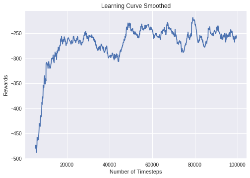
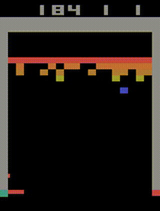

Examples
========

Try it online with Colab Notebooks!
-----------------------------------

All the following examples can be executed online using Google colab |colab|
notebooks:

-  `Getting Started`_
-  `Training, Saving, Loading`_
-  `Multiprocessing`_
-  `Monitor Training and Plotting`_
-  `Atari Games`_
-  `Breakout`_ (trained agent included)
-  `Hindsight Experience Replay`_
-  `RL Baselines zoo`_

.. _Getting Started: https://colab.research.google.com/drive/1_1H5bjWKYBVKbbs-Kj83dsfuZieDNcFU
.. _Training, Saving, Loading: https://colab.research.google.com/drive/16QritJF5kgT3mtnODepld1fo5tFnFCoc
.. _Multiprocessing: https://colab.research.google.com/drive/1ZzNFMUUi923foaVsYb4YjPy4mjKtnOxb
.. _Monitor Training and Plotting: https://colab.research.google.com/drive/1L_IMo6v0a0ALK8nefZm6PqPSy0vZIWBT
.. _Atari Games: https://colab.research.google.com/drive/1iYK11yDzOOqnrXi1Sfjm1iekZr4cxLaN
.. _Breakout: https://colab.research.google.com/drive/14NwwEHwN4hdNgGzzySjxQhEVDff-zr7O
.. _Hindsight Experience Replay: https://colab.research.google.com/drive/1VDD0uLi8wjUXIqAdLKiK15XaEe0z2FOc
.. _RL Baselines zoo: https://colab.research.google.com/drive/1cPGK3XrCqEs3QLqiijsfib9OFht3kObX

Basic Usage: Training, Saving, Loading
--------------------------------------

In the following example, we will train, save and load a DQN model on the Lunar Lander environment.

.. figure:: https://cdn-images-1.medium.com/max/960/1*f4VZPKOI0PYNWiwt0la0Rg.gif

  Lunar Lander Environment

.. note::
  LunarLander requires the python package `box2d`.
  You can install it using ``apt install swig`` and then ``pip install box2d box2d-kengz``

.. note::
  ``load`` function re-creates model from scratch on each call, which can be slow.
  If you need to e.g. evaluate same model with multiple different sets of parameters, consider
  using ``load_parameters`` instead.

.. code-block:: python

  import gym

  from stable_baselines import DQN

  # Create environment
  env = gym.make('LunarLander-v2')

  # Instantiate the agent
  model = DQN('MlpPolicy', env, learning_rate=1e-3, prioritized_replay=True, verbose=1)
  # Train the agent
  model.learn(total_timesteps=int(2e5))
  # Save the agent
  model.save("dqn_lunar")
  del model  # delete trained model to demonstrate loading

  # Load the trained agent
  model = DQN.load("dqn_lunar")

  # Enjoy trained agent
  obs = env.reset()
  for i in range(1000):
      action, _states = model.predict(obs)
      obs, rewards, dones, info = env.step(action)
      env.render()

Multiprocessing: Unleashing the Power of Vectorized Environments
----------------------------------------------------------------

.. figure:: https://cdn-images-1.medium.com/max/960/1*h4WTQNVIsvMXJTCpXm_TAw.gif

  CartPole Environment

.. code-block:: python

  import gym
  import numpy as np

  from stable_baselines.common.policies import MlpPolicy
  from stable_baselines.common.vec_env import SubprocVecEnv
  from stable_baselines.common import set_global_seeds
  from stable_baselines import ACKTR

  def make_env(env_id, rank, seed=0):
      """
      Utility function for multiprocessed env.

      :param env_id: (str) the environment ID
      :param num_env: (int) the number of environments you wish to have in subprocesses
      :param seed: (int) the inital seed for RNG
      :param rank: (int) index of the subprocess
      """
      def _init():
          env = gym.make(env_id)
          env.seed(seed + rank)
          return env
      set_global_seeds(seed)
      return _init

  env_id = "CartPole-v1"
  num_cpu = 4  # Number of processes to use
  # Create the vectorized environment
  env = SubprocVecEnv([make_env(env_id, i) for i in range(num_cpu)])

  model = ACKTR(MlpPolicy, env, verbose=1)
  model.learn(total_timesteps=25000)

  obs = env.reset()
  for _ in range(1000):
      action, _states = model.predict(obs)
      obs, rewards, dones, info = env.step(action)
      env.render()

Using Callback: Monitoring Training
-----------------------------------

You can define a custom callback function that will be called inside the agent.
This could be useful when you want to monitor training, for instance display live
learning curves in Tensorboard (or in Visdom) or save the best agent.
If your callback returns False, training is aborted early.

  Learning curve of DDPG on LunarLanderContinuous environment

.. code-block:: python

  import os

  import gym
  import numpy as np
  import matplotlib.pyplot as plt

  from stable_baselines.ddpg.policies import LnMlpPolicy
  from stable_baselines.bench import Monitor
  from stable_baselines.results_plotter import load_results, ts2xy
  from stable_baselines import DDPG
  from stable_baselines.ddpg import AdaptiveParamNoiseSpec

  best_mean_reward, n_steps = -np.inf, 0

  def callback(_locals, _globals):
    """
    Callback called at each step (for DQN an others) or after n steps (see ACER or PPO2)
    :param _locals: (dict)
    :param _globals: (dict)
    """
    global n_steps, best_mean_reward
    # Print stats every 1000 calls
    if (n_steps + 1) % 1000 == 0:
        # Evaluate policy training performance
        x, y = ts2xy(load_results(log_dir), 'timesteps')
        if len(x) > 0:
            mean_reward = np.mean(y[-100:])
            print(x[-1], 'timesteps')
            print("Best mean reward: {:.2f} - Last mean reward per episode: {:.2f}".format(best_mean_reward, mean_reward))

            # New best model, you could save the agent here
            if mean_reward > best_mean_reward:
                best_mean_reward = mean_reward
                # Example for saving best model
                print("Saving new best model")
                _locals['self'].save(log_dir + 'best_model.pkl')
    n_steps += 1
    return True

  # Create log dir
  log_dir = "/tmp/gym/"
  os.makedirs(log_dir, exist_ok=True)

  # Create and wrap the environment
  env = gym.make('LunarLanderContinuous-v2')
  env = Monitor(env, log_dir, allow_early_resets=True)

  # Add some param noise for exploration
  param_noise = AdaptiveParamNoiseSpec(initial_stddev=0.1, desired_action_stddev=0.1)
  # Because we use parameter noise, we should use a MlpPolicy with layer normalization
  model = DDPG(LnMlpPolicy, env, param_noise=param_noise, verbose=0)
  # Train the agent
  model.learn(total_timesteps=int(1e5), callback=callback)

Atari Games
-----------

  Trained A2C agent on Breakout

.. figure:: https://cdn-images-1.medium.com/max/960/1*UHYJE7lF8IDZS_U5SsAFUQ.gif

 Pong Environment

Training a RL agent on Atari games is straightforward thanks to ``make_atari_env`` helper function.
It will do `all the preprocessing <https://danieltakeshi.github.io/2016/11/25/frame-skipping-and-preprocessing-for-deep-q-networks-on-atari-2600-games/>`_
and multiprocessing for you.

.. code-block:: python

  from stable_baselines.common.cmd_util import make_atari_env
  from stable_baselines.common.vec_env import VecFrameStack
  from stable_baselines import ACER

  # There already exists an environment generator
  # that will make and wrap atari environments correctly.
  # Here we are also multiprocessing training (num_env=4 => 4 processes)
  env = make_atari_env('PongNoFrameskip-v4', num_env=4, seed=0)
  # Frame-stacking with 4 frames
  env = VecFrameStack(env, n_stack=4)

  model = ACER('CnnPolicy', env, verbose=1)
  model.learn(total_timesteps=25000)

  obs = env.reset()
  while True:
      action, _states = model.predict(obs)
      obs, rewards, dones, info = env.step(action)
      env.render()

Mujoco: Normalizing input features
----------------------------------

Normalizing input features may be essential to successful training of an RL agent
(by default, images are scaled but not other types of input),
for instance when training on `Mujoco <http://www.mujoco.org/>`_. For that, a wrapper exists and
will compute a running average and standard deviation of input features (it can do the same for rewards).

.. note::
  We cannot provide a notebook for this example
  because Mujoco is a proprietary engine and requires a license.

.. code-block:: python

  import gym

  from stable_baselines.common.policies import MlpPolicy
  from stable_baselines.common.vec_env import DummyVecEnv, VecNormalize
  from stable_baselines import PPO2

  env = DummyVecEnv([lambda: gym.make("Reacher-v2")])
  # Automatically normalize the input features
  env = VecNormalize(env, norm_obs=True, norm_reward=False,
                     clip_obs=10.)

  model = PPO2(MlpPolicy, env)
  model.learn(total_timesteps=2000)

  # Don't forget to save the running average when saving the agent
  log_dir = "/tmp/"
  model.save(log_dir + "ppo_reacher")
  env.save_running_average(log_dir)

Custom Policy Network
---------------------

Stable baselines provides default policy networks for images (CNNPolicies)
and other type of inputs (MlpPolicies).
However, you can also easily define a custom architecture for the policy network `(see custom policy section) <custom_policy.html>`_:

.. code-block:: python

  import gym

  from stable_baselines.common.policies import FeedForwardPolicy
  from stable_baselines.common.vec_env import DummyVecEnv
  from stable_baselines import A2C

  # Custom MLP policy of three layers of size 128 each
  class CustomPolicy(FeedForwardPolicy):
      def __init__(self, *args, **kwargs):
          super(CustomPolicy, self).__init__(*args, **kwargs,
                                             net_arch=[dict(pi=[128, 128, 128], vf=[128, 128, 128])],
                                             feature_extraction="mlp")

  model = A2C(CustomPolicy, 'LunarLander-v2', verbose=1)
  # Train the agent
  model.learn(total_timesteps=100000)

Accessing and modifying model parameters
----------------------------------------

You can access model's parameters via ``load_parameters`` and ``get_parameters`` functions, which
use dictionaries that map variable names to NumPy arrays.

These functions are useful when you need to e.g. evaluate large set of models with same network structure,
visualize different layers of the network or modify parameters manually.

You can access original Tensorflow Variables with function ``get_parameter_list``.

Following example demonstrates reading parameters, modifying some of them and loading them to model
by implementing `evolution strategy <http://blog.otoro.net/2017/10/29/visual-evolution-strategies/>`_
for solving ``CartPole-v1`` environment. The initial guess for parameters is obtained by running
A2C policy gradient updates on the model.

.. code-block:: python

  import gym
  import numpy as np

  from stable_baselines.common.policies import MlpPolicy
  from stable_baselines.common.vec_env import DummyVecEnv
  from stable_baselines import A2C

  def mutate(params):
      """Mutate parameters by adding normal noise to them"""
      return dict((name, param + np.random.normal(size=param.shape))
                  for name, param in params.items())

  def evaluate(env, model):
      """Return mean fitness (sum of episodic rewards) for given model"""
      episode_rewards = []
      for _ in range(10):
          reward_sum = 0
          done = False
          obs = env.reset()
          while not done:
              action, _states = model.predict(obs)
              obs, reward, done, info = env.step(action)
              reward_sum += reward
          episode_rewards.append(reward_sum)
      return np.mean(episode_rewards)

  # Create env
  env = gym.make('CartPole-v1')
  env = DummyVecEnv([lambda: env])
  # Create policy with a small network
  model = A2C(MlpPolicy, env, ent_coef=0.0, learning_rate=0.1,
              policy_kwargs={'net_arch': [8, ]})

  # Use traditional actor-critic policy gradient updates to
  # find good initial parameters
  model.learn(total_timesteps=5000)

  # Get the parameters as the starting point for ES
  mean_params = model.get_parameters()

  # Include only variables with "/pi/" (policy) or "/shared" (shared layers)
  # in their name: Only these ones affect the action.
  mean_params = dict((key, value) for key, value in mean_params.items()
                     if ("/pi/" in key or "/shared" in key))

  for iteration in range(10):
      # Create population of candidates and evaluate them
      population = []
      for population_i in range(100):
          candidate = mutate(mean_params)
          # Load new policy parameters to agent.
          # Tell function that it should only update parameters
          # we give it (policy parameters)
          model.load_parameters(candidate, exact_match=False)
          fitness = evaluate(env, model)
          population.append((candidate, fitness))
      # Take top 10% and use average over their parameters as next mean parameter
      top_candidates = sorted(population, key=lambda x: x[1], reverse=True)[:10]
      mean_params = dict(
          (name, np.stack([top_candidate[0][name] for top_candidate in top_candidates]).mean(0))
          for name in mean_params.keys()
      )
      mean_fitness = sum(top_candidate[1] for top_candidate in top_candidates) / 10.0
      print("Iteration {:<3} Mean top fitness: {:.2f}".format(iteration, mean_fitness))

Recurrent Policies
------------------

This example demonstrate how to train a recurrent policy and how to test it properly.

.. warning::

  One current limitation of recurrent policies is that you must test them
  with the same number of environments they have been trained on.

.. code-block:: python

  from stable_baselines import PPO2

  # For recurrent policies, with PPO2, the number of environments run in parallel
  # should be a multiple of nminibatches.
  model = PPO2('MlpLstmPolicy', 'CartPole-v1', nminibatches=1, verbose=1)
  model.learn(50000)

  # Retrieve the env
  env = model.get_env()

  obs = env.reset()
  # Passing state=None to the predict function means
  # it is the initial state
  state = None
  # When using VecEnv, done is a vector
  done = [False for _ in range(env.num_envs)]
  for _ in range(1000):
      # We need to pass the previous state and a mask for recurrent policies
      # to reset lstm state when a new episode begin
      action, state = model.predict(obs, state=state, mask=done)
      obs, reward , done, _ = env.step(action)
      # Note: with VecEnv, env.reset() is automatically called

      # Show the env
      env.render()

Hindsight Experience Replay (HER)
---------------------------------

For this example, we are using `Highway-Env <https://github.com/eleurent/highway-env>`_ by `@eleurent <https://github.com/eleurent>`_.

.. figure:: https://raw.githubusercontent.com/eleurent/highway-env/gh-media/docs/media/parking-env.gif

   The highway-parking-v0 environment.

The parking env is a goal-conditioned continuous control task, in which the vehicle must park in a given space with the appropriate heading.

.. note::

	the hyperparameters in the following example were optimized for that environment.

.. code-block:: python

  import gym
  import highway_env
  import numpy as np

  from stable_baselines import HER, SAC, DDPG, TD3
  from stable_baselines.ddpg import NormalActionNoise

  env = gym.make("parking-v0")

  # Create 4 artificial transitions per real transition
  n_sampled_goal = 4

  # SAC hyperparams:
  model = HER('MlpPolicy', env, SAC, n_sampled_goal=n_sampled_goal,
              goal_selection_strategy='future',
              verbose=1, buffer_size=int(1e6),
              learning_rate=1e-3,
              gamma=0.95, batch_size=256,
              policy_kwargs=dict(layers=[256, 256, 256]))

  # DDPG Hyperparams:
  # NOTE: it works even without action noise
  # n_actions = env.action_space.shape[0]
  # noise_std = 0.2
  # action_noise = NormalActionNoise(mean=np.zeros(n_actions), sigma=noise_std * np.ones(n_actions))
  # model = HER('MlpPolicy', env, DDPG, n_sampled_goal=n_sampled_goal,
  #             goal_selection_strategy='future',
  #             verbose=1, buffer_size=int(1e6),
  #             actor_lr=1e-3, critic_lr=1e-3, action_noise=action_noise,
  #             gamma=0.95, batch_size=256,
  #             policy_kwargs=dict(layers=[256, 256, 256]))

  model.learn(int(2e5))
  model.save('her_sac_highway')

  # Load saved model
  model = HER.load('her_sac_highway', env=env)

  obs = env.reset()

  # Evaluate the agent
  episode_reward = 0
  for _ in range(100):
  	action, _ = model.predict(obs)
  	obs, reward, done, info = env.step(action)
  	env.render()
  	episode_reward += reward
  	if done or info.get('is_success', False):
  		print("Reward:", episode_reward, "Success?", info.get('is_success', False))
  		episode_reward = 0.0
  		obs = env.reset()

Continual Learning
------------------

You can also move from learning on one environment to another for `continual learning <https://www.continualai.com/>`_
(PPO2 on ``DemonAttack-v0``, then transferred on ``SpaceInvaders-v0``):

.. code-block:: python

  from stable_baselines.common.cmd_util import make_atari_env
  from stable_baselines import PPO2

  # There already exists an environment generator
  # that will make and wrap atari environments correctly
  env = make_atari_env('DemonAttackNoFrameskip-v4', num_env=8, seed=0)

  model = PPO2('CnnPolicy', env, verbose=1)
  model.learn(total_timesteps=10000)

  obs = env.reset()
  for i in range(1000):
      action, _states = model.predict(obs)
      obs, rewards, dones, info = env.step(action)
      env.render()

  # The number of environments must be identical when changing environments
  env = make_atari_env('SpaceInvadersNoFrameskip-v4', num_env=8, seed=0)

  # change env
  model.set_env(env)
  model.learn(total_timesteps=10000)

  obs = env.reset()
  while True:
      action, _states = model.predict(obs)
      obs, rewards, dones, info = env.step(action)
      env.render()

Record a Video
--------------

Record a mp4 video (here using a random agent).

.. note::

  It requires ffmpeg or avconv to be installed on the machine.

.. code-block:: python

  import gym
  from stable_baselines.common.vec_env import VecVideoRecorder, DummyVecEnv

  env_id = 'CartPole-v1'
  video_folder = 'logs/videos/'
  video_length = 100

  env = DummyVecEnv([lambda: gym.make(env_id)])

  obs = env.reset()

  # Record the video starting at the first step
  env = VecVideoRecorder(env, video_folder,
                         record_video_trigger=lambda x: x == 0, video_length=video_length,
                         name_prefix="random-agent-{}".format(env_id))

  env.reset()
  for _ in range(video_length + 1):
    action = [env.action_space.sample()]
    obs, _, _, _ = env.step(action)
  env.close()

Bonus: Make a GIF of a Trained Agent
------------------------------------

.. note::
  For Atari games, you need to use a screen recorder such as `Kazam <https://launchpad.net/kazam>`_.
  And then convert the video using `ffmpeg <https://superuser.com/questions/556029/how-do-i-convert-a-video-to-gif-using-ffmpeg-with-reasonable-quality>`_

.. code-block:: python

  import imageio
  import numpy as np

  from stable_baselines.common.policies import MlpPolicy
  from stable_baselines import A2C

  model = A2C(MlpPolicy, "LunarLander-v2").learn(100000)

  images = []
  obs = model.env.reset()
  img = model.env.render(mode='rgb_array')
  for i in range(350):
      images.append(img)
      action, _ = model.predict(obs)
      obs, _, _ ,_ = model.env.step(action)
      img = model.env.render(mode='rgb_array')

  imageio.mimsave('lander_a2c.gif', [np.array(img[0]) for i, img in enumerate(images) if i%2 == 0], fps=29)
