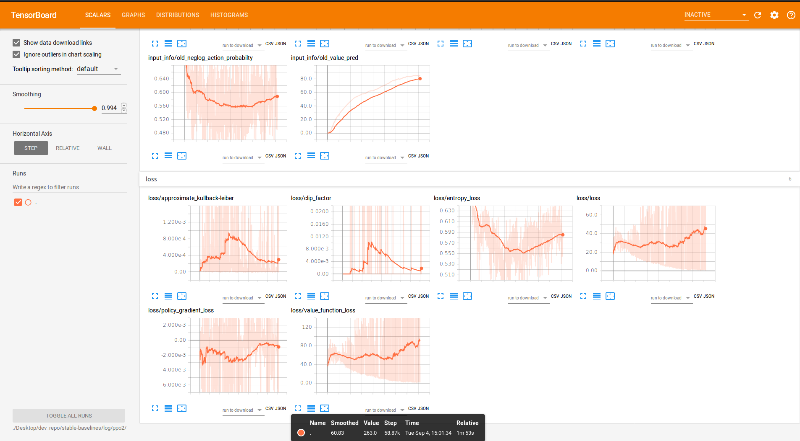
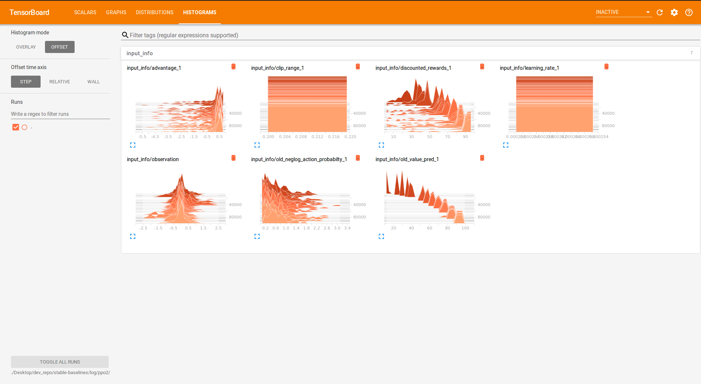
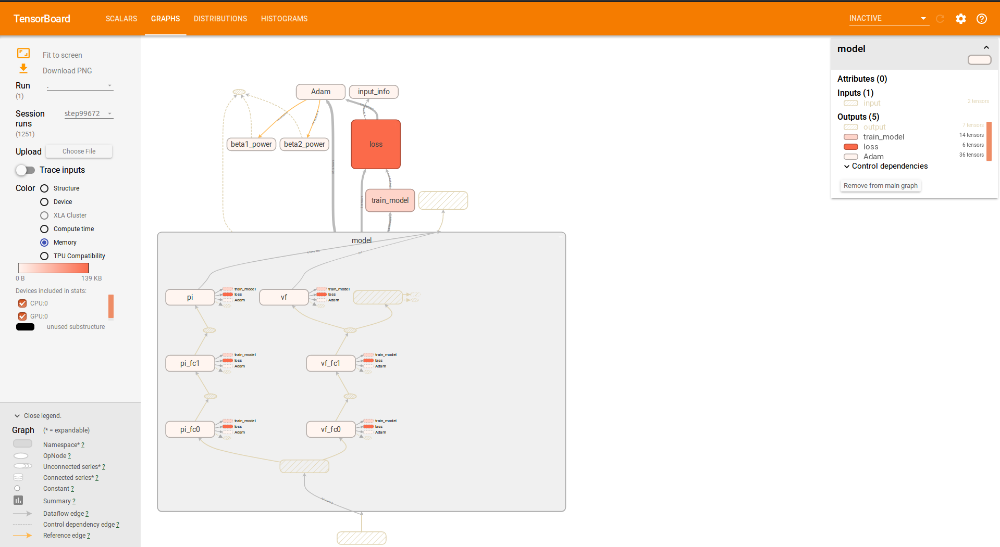

.. _tensorboard:

Tensorboard Integration
==========================

Basic Usage
------------

To use Tensorboard with the rl baselines, you simply need to define a log location for the RL agent:

.. code-block:: python

    import gym

    from stable_baselines import A2C

    model = A2C('MlpPolicy', 'CartPole-v1', verbose=1, tensorboard_log="./a2c_cartpole_tensorboard/")
    model.learn(total_timesteps=10000)

Or after loading an existing model (by default the log path is not saved):

.. code-block:: python

    import gym

    from stable_baselines.common.vec_env import DummyVecEnv
    from stable_baselines import A2C

    env = gym.make('CartPole-v1')
    env = DummyVecEnv([lambda: env])  # The algorithms require a vectorized environment to run

    model = A2C.load("./a2c_cartpole.pkl", env=env, tensorboard_log="./a2c_cartpole_tensorboard/")
    model.learn(total_timesteps=10000)

You can also define custom logging name when training (by default it is the algorithm name)

.. code-block:: python

    import gym

    from stable_baselines import A2C

    model = A2C('MlpPolicy', 'CartPole-v1', verbose=1, tensorboard_log="./a2c_cartpole_tensorboard/")
    model.learn(total_timesteps=10000, tb_log_name="first_run")
    # Pass reset_num_timesteps=False to continue the training curve in tensorboard
    # By default, it will create a new curve
    model.learn(total_timesteps=10000, tb_log_name="second_run", reset_num_timesteps=False)
    model.learn(total_timesteps=10000, tb_log_name="thrid_run", reset_num_timesteps=False)

Once the learn function is called, you can monitor the RL agent during or after the training, with the following bash command:

.. code-block:: bash

  tensorboard --logdir ./a2c_cartpole_tensorboard/

you can also add past logging folders:

.. code-block:: bash

  tensorboard --logdir ./a2c_cartpole_tensorboard/;./ppo2_cartpole_tensorboard/

It will display information such as the model graph, the episode reward, the model losses, the observation and other parameter unique to some models.

Legacy Integration
-------------------

All the information displayed in the terminal (default logging) can be also logged in tensorboard.
For that, you need to define several environment variables:

.. code-block:: bash

  # formats are comma-separated, but for tensorboard you only need the last one
  # stdout -> terminal
  export OPENAI_LOG_FORMAT='stdout,log,csv,tensorboard'
  export OPENAI_LOGDIR=path/to/tensorboard/data

Then start tensorboard with:

.. code-block:: bash

  tensorboard --logdir=$OPENAI_LOGDIR
